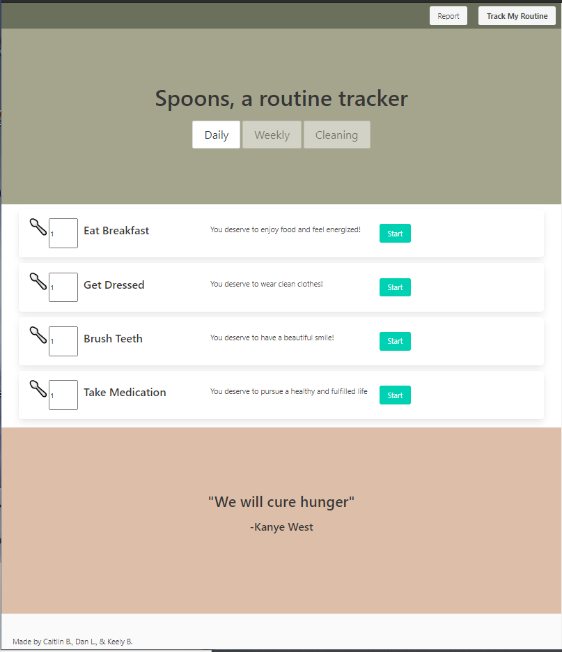
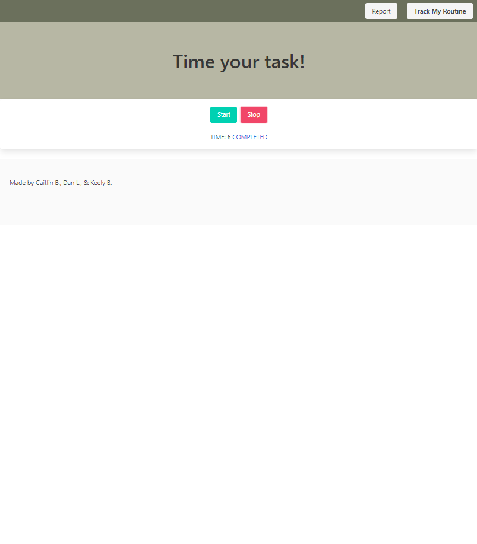
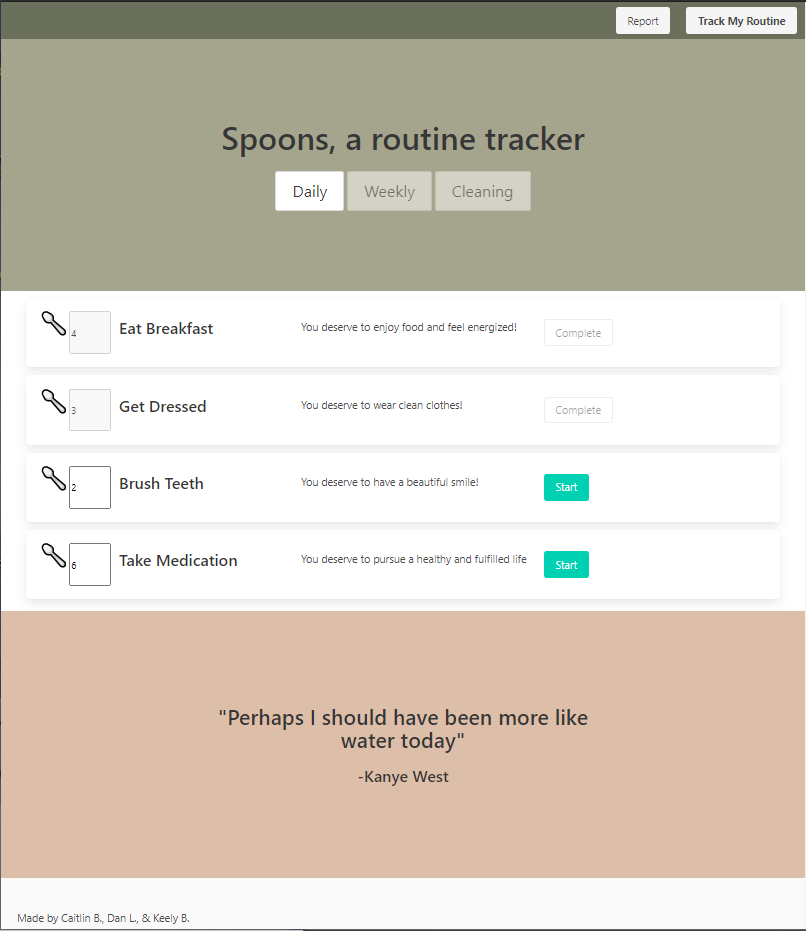
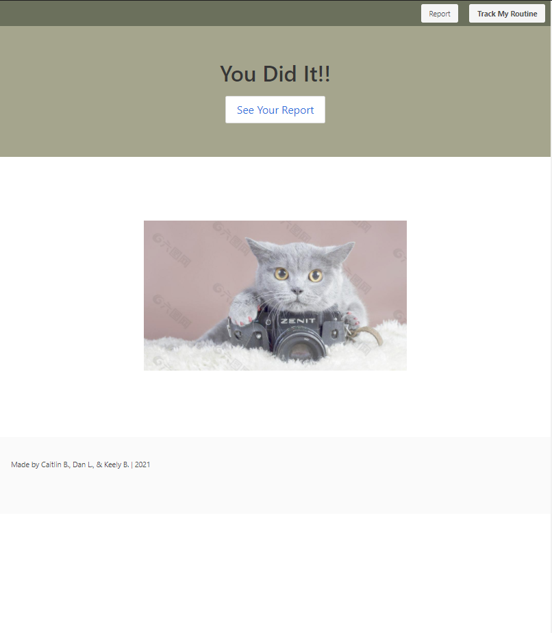
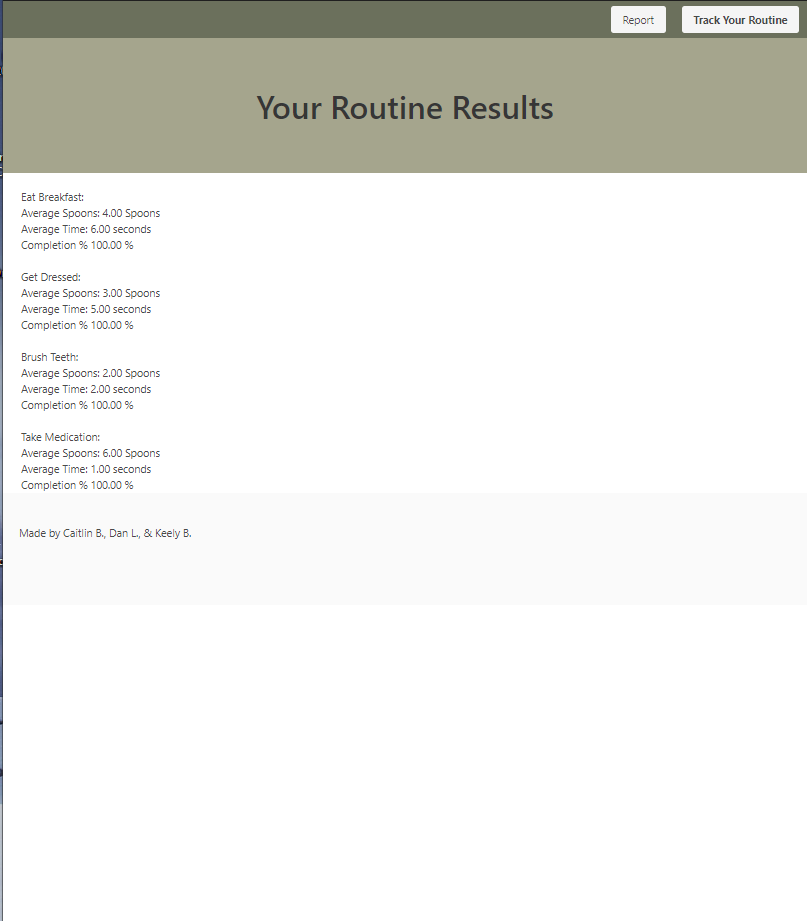

# Spoons, a routine tracker

## Table of Contents

- [Overview](#overview)
- [Built With](#built-with)
- [Features](#features)
- [Contact](#contact)
- [Acknowledgements](#acknowledgements)

## Overview

Spoons is a progress tracker built specifically for the neurodivergent community. The program utilizes both set tasks (which are a part of the minimum standard for independent living), and custom tasks that can be inputted by the user.

Tracking is accomplished through timers that are linked to each task, as well as a text input area for the amount of “spoons” the task takes.

Our motivation for development was to create a task tracker that was simple, free from distractions, and easily accessible to the user. Our original idea was to create a progress tracker, which was developed further to appeal to a niche audience. As we developed further, we decided to cater to the neurodivergent community, specifically those that live with ADD/ADHD, or those struggle to focus on daily tasks that impede independent living. Research was conducted as to what tasks were vital for daily living, and reaching those milestones is the core of our product.

Github: https://github.com/D-Loot/spoons
Website: https://d-loot.github.io/spoons/

### Built With

Framework
Bulma - https://bulma.io/

Time - Third Party Web API
Moment.js - https://momentjs.com/docs/

APIs
Quote Generator
kanye.rest - https://kanye.rest/

Kittin Picture Generator
thecatapi - https://thecatapi.com/

## Features

The web page tracks user input for daily routines and displays the statistics on a result page. Tracking is accomplished through timers that are linked to each task, as well as a text input area for the amount of “spoons” the task takes. If the user completes all of the tasks, they are directed to a random picture of a cat as a reward. As more and more data is gathered, the amount of time and number of spoons it takes to accomplish a task should become more and more accurate.

## Contact

Github
Dan Looten - https://github.com/D-Loot
Keely Bailey - https://github.com/spacerambler
Caitlin Birenbaum - https://github.com/CaitlinBirenbaum

## Acknowledgements

References are located within the Javascript code
